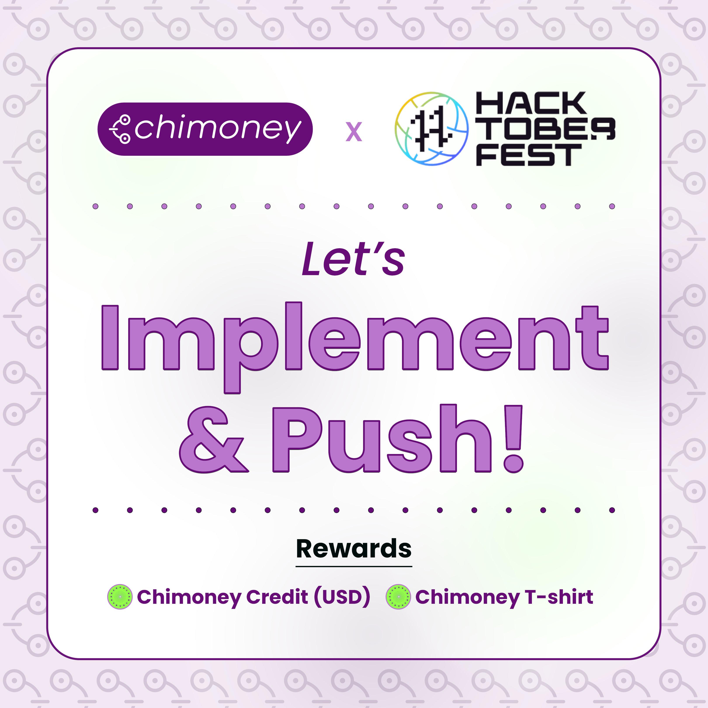

# Chimoney Community Projects

This repository houses projects worked on by the [Chimoney](https://chimoney.io) community.

## [HacktoberFest](https://hacktoberfest.com) 🎉🎉🎉

Hacktoberfest is a month-long celebration of open-source projects, their maintainers, and the entire community of contributors. This event is all about giving back to the community and celebrating all things open source.

## [Chimoney x HacktoberFest](https://twitter.com/chimoney_io/status/1576286913723596803?s=48&t=JCGsKCKdKEB_sVfGml2m6w) 🎉🎉🎉

In light of the month long celebration of hacking for people in tech [HacktoberFest](https://hacktoberfest.com), [Chimoney](https://chimoney.io) is awarding contributors with exciting gifts (cash rewards, Swags). _Excited already 😁😁?_
  
### **What will you be working on for HactoberFest?**

You will mainly be interfacing with `two(2)` of our products.

- [ChiSpend](https://chispend.com)

  
 Unlock utility.
Make Crypto Tokens & NFTs spendable. Integrate your own platform tokens also and build out your custom spend experience.
  

  
- [ChiConnect](https://chimoney.readme.io) Powerful api that enables moving payouts of non dimishing value across banks, giftcards, airtime, momo, etc.
  

### **Get Started**
 
 You will need `keys` to interface with our products. To do so, follow these simple steps below:

 - Create a organization on [Chimoney Dashboard](https://dash.chimoney.io).
 - Send [us](mailto:support@chimoney.io) the name of the organization, we will approve it!
- Switch to the organization (top right) and go to dev page, you’d see your keys. It’s `live keys`, for now. No test keys yet.
 - We will add $10 for testing. You can always send $1 to yourself to test and redeem it back to the organization. That way, you always have funds.

 _We can't wait to see your contribution!!!_

### **Rewards💸💸**
🎃 Each merged PR gets $25
👻 Each contributor can get this gift up to four times ( 25 * 4 ) = $100

🔮 Bonus! A contributor completing 4 merged PRs gets a T-shirt.

### **Start contributing🍾** 
-  `ChiConnect`: For [ChiConnect](https://chimoney.readme.io) click [here](https://github.com/Chimoney/chimoney-api-community-projects/issues?q=is%3Aopen+is%3Aissue+label%3AChiConnect).
-  `ChiSpend`: For [ChiSpend](https://chimoney.readme.io) click [here](https://github.com/Chimoney/chimoney-api-community-projects/issues?q=is%3Aopen+is%3Aissue+label%3AChiSpend).

__P.S__: Add `hacktoberfest` to your pull-requests, those pr's get first priority, your code/submission should be contained in the [submissions](submissions) folder.

__NOTE:__
For guidelines checkout [Contribution guidelines](CONTRIBUTING.md).

__Happy Hacking!!!__

