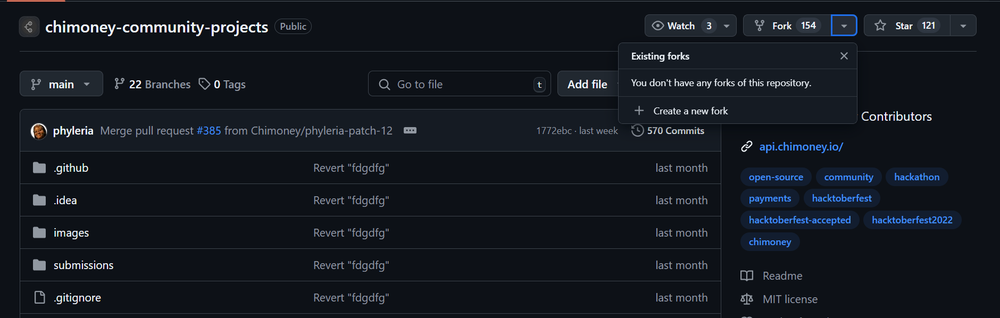
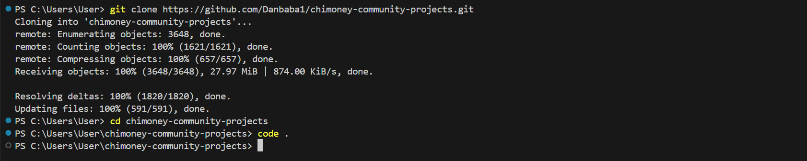

# Contributing to Chimoney Projects: A Hacktoberfest 2024 Guide

## 1. Introduction to Hacktoberfest and Chimoney

### What is Hacktoberfest?

Hacktoberfest is an annual event that celebrates open source software and encourages meaningful contributions to open source projects. It's sponsored by DigitalOcean and runs throughout the month of October. Participants who successfully complete the challenge by making 4 valid pull requests to open source repositories are eligible for exciting rewards and recognition.

### Overview of Chimoney's Platform and API

Chimoney is a global payouts and infrastructure provider offering an API that businesses, startups, and communities can integrate to handle bulk payouts, rewards, or disbursements in multiple currencies. Chimoney enables users to send money, gift cards, airtime, and other digital assets to recipients worldwide, making it easier for organizations of all sizes, especially those with distributed teams or diverse communities, to manage payments efficiently.

#### Key features of Chimoney include:

- **Bulk payouts**: Organizations can send payments to multiple recipients at once, with recipients able to redeem in their local currencies, saving time and effort.
- **Multi-currency support**: Chimoney supports a range of currencies, including USD, CAD, and NGN, for global transactions.
- **Payment requests**: Chimoney simplifies the process of requesting and receiving payments, making it easier for users to get paid.
- **API integration**: Developers can integrate Chimoney’s API into their systems, automating payment processes and scaling effortlessly.

### Why Open-Source Contributions Matter to Chimoney

Open-source contributions are vital to Chimoney's growth and innovation. By engaging with the developer community, Chimoney can:

- Improve its platform and API based on real-world use cases and feedback
- Foster innovation through collaboration with developers worldwide
- Build a strong, supportive community around its products
- Enhance documentation and examples, making it easier for new developers to adopt Chimoney's solutions

## 2. Step-by-Step Contribution Guide

### Requirements for Contributing

Before you start contributing, make sure you have:

- A GitHub account
- Git installed on your local machine
- Node.js and npm (for running JavaScript projects)
- Basic knowledge of JavaScript, React, or relevant technologies used in Chimoney's projects

### How to Set Up the Project Locally

#### Cloning the Repository

1. Fork the Chimoney repository you want to contribute to by clicking the "Fork" button on GitHub.



2. Clone your forked repository to your local machine:


```bash
git clone https://github.com/your-username/repository-name.git
cd repository-name
```



#### Running the Project Locally

1. Install the project dependencies:

```bash
npm install
```

2. Set up any necessary environment variables (refer to the project's README for specific instructions).

3. Start the development server:

```bash
npm run dev
```

## 3. Making Your First Contribution

### How to Choose an Issue

1. Browse the issues in the Chimoney repository you're interested in.
2. Look for issues labeled `good first issue` or `help wanted` for beginner-friendly tasks.
3. Read through the issue description and comments to understand the requirements.

### Being Assigned an Issue

1. Comment on the issue expressing your interest in working on it.
2. Wait for a maintainer to assign the issue to you.

### Contributing Code or Documentation

1. Create a new branch for your contribution:

```bash
git checkout -b feature/your-feature-name
```

2. Make your changes, following the project's coding style and guidelines.
3. Test your changes thoroughly.
4. Commit your changes with a meaningful commit message:

```bash
git commit -m "Add feature: Brief description of your changes"
```

### How to Create and Submit a Pull Request (PR)

1. Push your changes to your forked repository:

```bash
git push origin feature/your-feature-name
```

2. Go to the original Chimoney repository on GitHub and click "New pull request".
3. Choose your fork and the branch containing your changes.
4. Fill out the PR template, providing a clear description of your changes.
5. Submit the pull request for review.

### Best Practices for Clean and Maintainable Code

- Follow the project's coding style and conventions.
- Write clear, concise comments and documentation.
- Keep your changes focused and avoid unrelated modifications.
- Write unit tests for new features or bug fixes when applicable.

## 4. Opportunities for Contribution

### Areas Where Chimoney Needs Contributions

- Bug fixes and performance improvements
- New features aligned with Chimoney's roadmap
- Documentation improvements and translations
- Integration examples and SDKs in various programming languages

### Creating Technical Articles or Guides

Consider writing technical articles or guides about:

- Integrating Chimoney's API into different types of applications
- Best practices for using Chimoney in specific use cases
- Tutorials on using Chimoney's features effectively

## 5. Contribution Guidelines

### Overview of Chimoney's Contribution Guidelines

- Always create an issue before submitting a pull request for new features.
- Follow the code of conduct and maintain a respectful, inclusive environment.
- Keep pull requests focused on a single issue or feature.

### How to Write Meaningful Commit Messages

- Use the imperative mood (e.g., "Add feature" instead of "Added feature")
- Keep the first line short (50 characters or less) and descriptive
- Use the body of the commit message to explain the "why" behind the changes

## Code of Conduct

### Our Pledge

We as members, contributors, and leaders pledge to make participation in our
community a harassment-free experience for everyone, regardless of age, body
size, visible or invisible disability, ethnicity, sex characteristics, gender
identity and expression, level of experience, education, socio-economic status,
nationality, personal appearance, race, religion, or sexual identity
and orientation.

We pledge to act and interact in ways that contribute to an open, welcoming,
diverse, inclusive, and healthy community.

## Our Standards

Examples of behavior that contributes to a positive environment for our
community include:

* Demonstrating empathy and kindness towards other people
* Being respectful of differing opinions, viewpoints, and experiences
* Giving and gracefully accepting constructive feedback
* Accepting responsibility and apologizing to those affected by our mistakes,
  and learning from the experience
* Focusing on what is best not just for us as individuals, but for the
  overall community

Examples of unacceptable behavior include:

* The use of sexualized language or imagery, and sexual attention or
  advances of any kind
* Trolling, insulting or derogatory comments, and personal or political attacks
* Public or private harassment
* Publishing others' private information, such as a physical or email
  address, without their explicit permission
* Other conduct which could reasonably be considered inappropriate in a
  professional setting

## Enforcement Responsibilities

Community leaders are responsible for clarifying and enforcing our standards of
acceptable behavior and will take appropriate and fair corrective actions in
response to any behavior that they deem inappropriate, threatening, offensive,
or harmful.

Community leaders have the right and responsibility to remove, edit, or reject
comments, commits, code, wiki edits, issues, and other contributions that are
not aligned to this Code of Conduct, and will communicate reasons for moderation
decisions when appropriate.

## Scope

This Code of Conduct applies within all community spaces, and also applies when
an individual is officially representing the community in public spaces.
Examples of representing our community include using an official e-mail address,
posting via an official social media account, or acting as an appointed
representative at an online or offline event.

## Enforcement

Instances of abusive, harassing, or otherwise unacceptable behavior may be
reported to the community leaders responsible for enforcement at
team@chimoney.io.
All complaints will be reviewed and investigated promptly and fairly.

All community leaders are obligated to respect the privacy and security of the
reporter of any incident.

## Enforcement Guidelines

Community leaders will follow these Community Impact Guidelines in determining
the consequences for any action they deem in violation of this Code of Conduct:

### 1. Correction

**Community Impact**: Use of inappropriate language or other behavior deemed
unprofessional or unwelcome in the community.

**Consequence**: A private, written warning from community leaders, providing
clarity around the nature of the violation and an explanation of why the
behavior was inappropriate. A public apology may be requested.

### 2. Warning

**Community Impact**: A violation through a single incident or series
of actions.

**Consequence**: A warning with consequences for continued behavior. No
interaction with the people involved, including unsolicited interaction with
those enforcing the Code of Conduct, for a specified period of time. This
includes avoiding interactions in community spaces as well as external channels
like social media. Violating these terms may lead to a temporary or
permanent ban.

### 3. Temporary Ban

**Community Impact**: A serious violation of community standards, including
sustained inappropriate behavior.

**Consequence**: A temporary ban from any sort of interaction or public
communication with the community for a specified period of time. No public or
private interaction with the people involved, including unsolicited interaction
with those enforcing the Code of Conduct, is allowed during this period.
Violating these terms may lead to a permanent ban.

### 4. Permanent Ban

**Community Impact**: Demonstrating a pattern of violation of community
standards, including sustained inappropriate behavior,  harassment of an
individual, or aggression toward or disparagement of classes of individuals.

**Consequence**: A permanent ban from any sort of public interaction within
the community.

## Attribution

This Code of Conduct is adapted from the [Contributor Covenant][homepage],
version 2.0, available at
https://www.contributor-covenant.org/version/2/0/code_of_conduct.html.

Community Impact Guidelines were inspired by [Mozilla's code of conduct
enforcement ladder](https://github.com/mozilla/diversity).

[homepage]: https://www.contributor-covenant.org

For answers to common questions about this code of conduct, see the FAQ at
https://www.contributor-covenant.org/faq. Translations are available at
https://www.contributor-covenant.org/translations.

## 6. Benefits of Participating

### What Contributors Gain from Hacktoberfest

- Practical experience working on real-world projects
- Networking opportunities within the open-source community
- Hacktoberfest swag (t-shirts, stickers) for qualifying participants
- Personal growth and learning new technologies

### How Contributions Impact Chimoney's Platform and Mission

Your contributions help Chimoney:

- Improve its products and services
- Reach a wider audience of developers and businesses
- Accelerate innovation in global payment solutions
- Create a more robust and reliable platform for users worldwide

## 7. Next Steps After Contribution

### Staying Involved in the Chimoney Community

- Join Chimoney's developer community on platforms like [Discord](https://discord.gg/TsyKnzT4qV)
- Attend Chimoney's events [here](https://lu.ma/Chimoney) to connect with its global community and be updated with the community initiatives.

### Opportunities for Continuous Contributions

- Consider becoming a regular contributor 
- Mentor new contributors and help them get started
- Propose and lead new initiatives or features within the Chimoney ecosystem

By contributing to Chimoney's open-source projects, you're not just improving your skills and building your portfolio—you're also making a tangible impact on global financial inclusivity and innovation. We look forward to your contributions and can't wait to see what we can achieve together during Hacktoberfest 2024 and beyond!

## About the Author
### Daniel Oladepo
Daniel Oladepo is a passionate backend developer and software engineer with a strong foundation in mechanical engineering. With a keen interest in web technologies and server-side development, Daniel has contributed to various projects, from creating reusable templates to developing full-fledged messaging systems. His diverse skill set spans multiple programming languages and frameworks, making him a versatile developer capable of tackling complex challenges. Daniel's experience in both academic and professional settings demonstrates his commitment to continuous learning and innovation in the field of software development.
