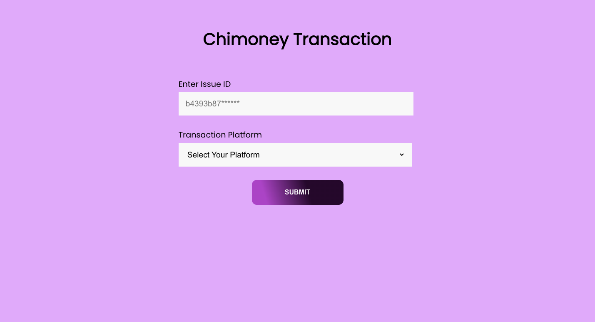
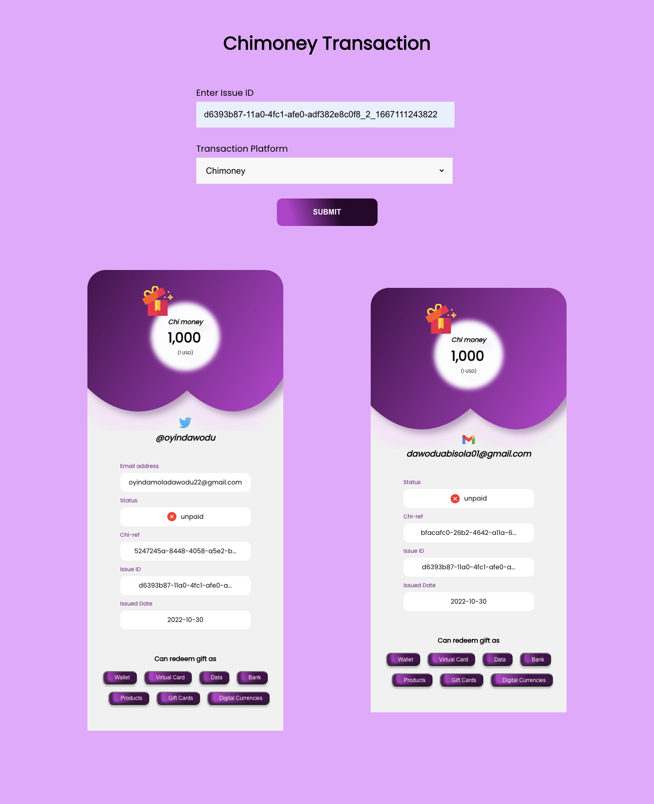

# Chimoney-Initiate-Airtime
Reward UI that takes a Chimoney issueID and renders a list of Pretty cards

view the deployed project [here](https://pay-chimoney.vercel.app/)

## Getting Started with Chimoney-Redeem-Airtime Project
Run the following commands in the project directory

- `npm install`
- `npm start`

Runs the app in the development mode.\
Open [http://localhost:3000](http://localhost:3000) to view it in your browser.

## Screenshots of the the project

