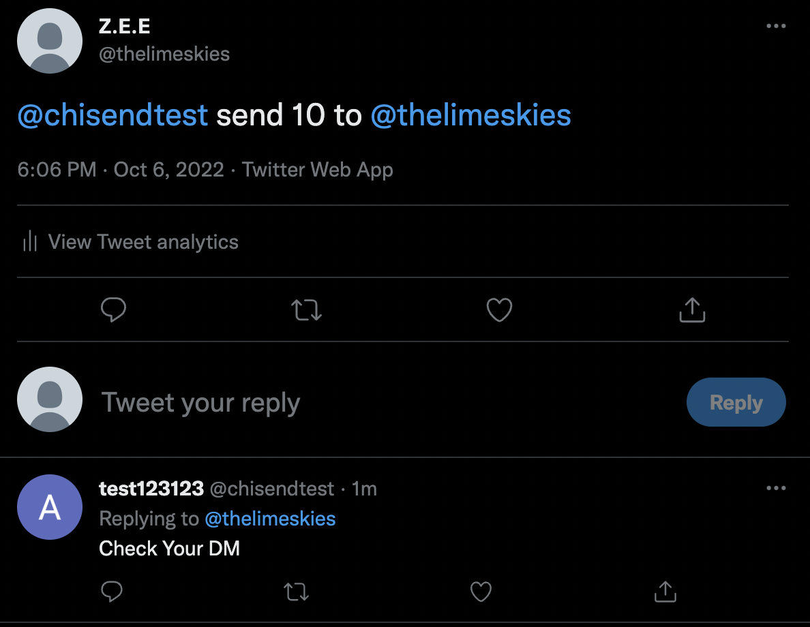
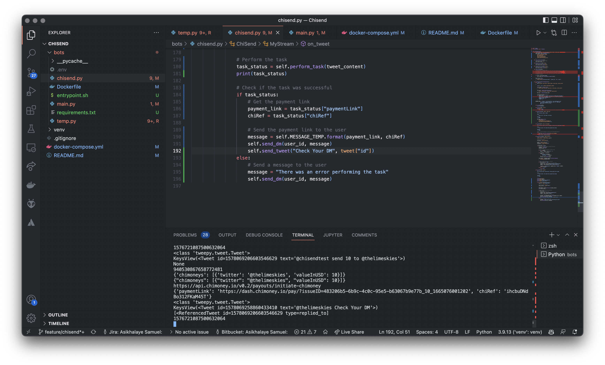
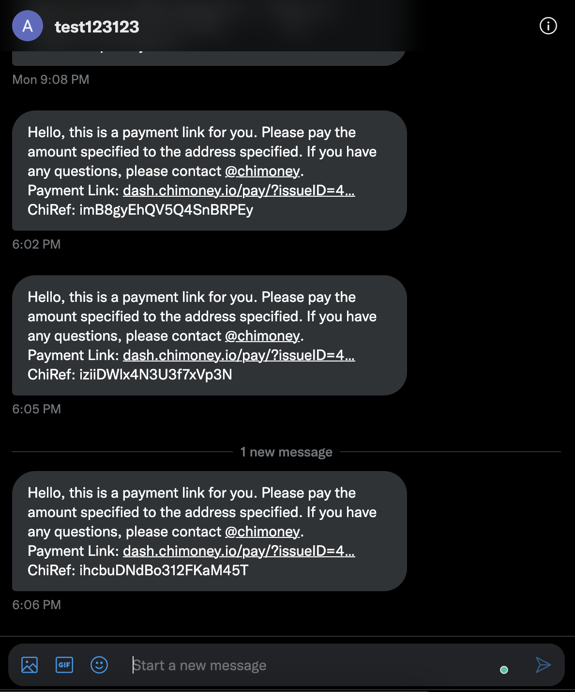

# CHISEND TWITTER BOT

The Chisend Twitter Bot that send chimoney to a user when called by a tweet.

Live Demo: https://twitter.com/send_chimoney

Docker is supported.


## INFO

The bot is written in Python and uses the [Tweepy](https://www.tweepy.org/) library to interact with the Twitter API.
It Uses the pychimoney library to send the chimoney.

## How to use
- Follow the bot on twitter
- Tweet the bot with the following format
    - @chisendtest send amount to @username
- The bot will you a direct message for confirmation and checkout
- ChiSpend will send the amount to the user

FOR EXAMPLE
@chisendtest send 100 to @chisendtest

FOR multiple users
@chisendtest send 100 to @chisendtest, @chisendtest2

## DEMO PICTURES
Example of a tweet to the bot







## How to run
    - Clone the repo
    - Create a .env file with the following variables
        - API_KEY
        - API_SECRET
        - BEARER_TOKEN
        - ACCESS_TOKEN
        - ACCESS_TOKEN_SECRET
        - CHIMONEY_API_KEY
        - SCREEN_NAME (is the twitter handle of the bot)
    - Docker build -t chisend .
    - Docker run -d chisend -e API_KEY= -e API_SECRET=   -e BEARER_TOKEN= -e ACCESS_TOKEN= -e ACCESS_TOKEN_SECRET= -e CHIMONEY_API_KEY= -e SCREEN_NAME=

    if the bot is not a developer account, you will need to use oauth-key-gen to get the keys

    - cd into bots folder
    - pip install -r requirements.txt
    - set access_token, access_token_secret(get from twitter developer dashboard)
    - python oauth-key-gen.py
    - click the link and get the pin
    - paste the pin in the terminal
    - copy the access_token and access_token_secret and paste in the .env file
OR
    - Create a virtual environment
    - Install the requirements
    - Run the ```python  ./main.py -ue ``` command
        to use the environment variables
    - Run the ```python  ./main.py ``` command

## TODO 
- [x] Get a developer Twitter Account to test 
- [x] Integate with chimoney-py
    - [x] Test the bot
- [ ] Deploy the bot
- [ ] Add a web interface to the bot
- [ ] Make sending Asynchronous using celery
- [ ] Add multi-user send 
- [ ] Add More features

## BLOCKERS
- [x] Get a developer Twitter Account to test 
- [x] Integrate with chimoney-py
    - [x] Test the bot