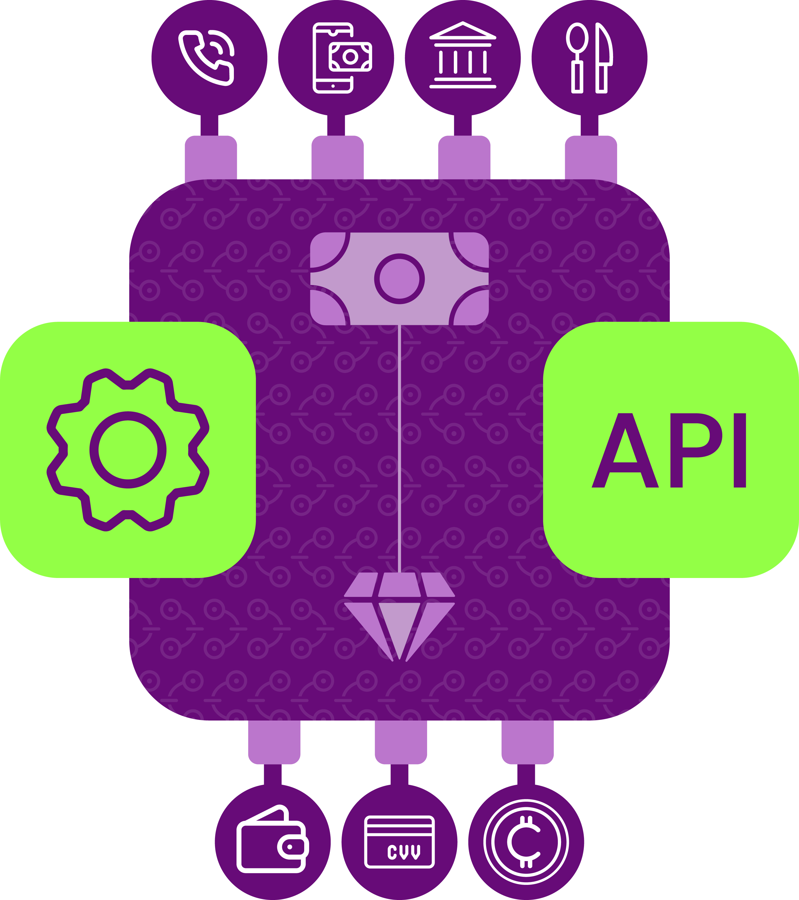
CHICONNECT is a payment infrastructure API for businesses, Developers, Fintechs and startups created by [CHIMONEY](https://chimoney.io) to move non-diminishing rewards between banks, redeem giftcards, airtime, mobile money and so-on.


<b>SETTING UP YOUR CHIMONEY ACCOUNT</b>

To get started You will need to create an account at [CHIMONEY](https://chimoney.io). Sign up with your email or gmail


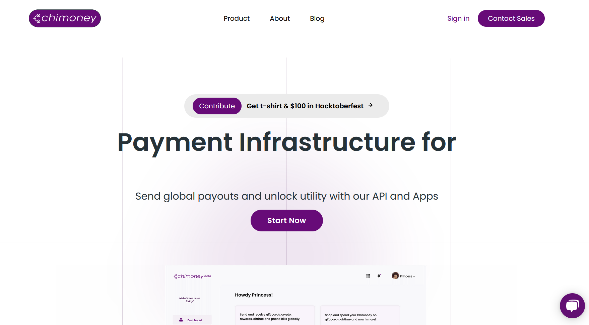


<b>AUTHENTICATION AND GETTING API KEY</b>

The CHICONNECT (API) can be called using an API KEY. After creating your account , getting your API_KEY follows 2 short process:
1. Email [support@chimoney.io](support@chimoney.io) to request "Verification and API Access". Also Include Links to your website, mobile or web app and tell a little more about your use case. Alternatively you can [schedule-a-demo](https://www.chimoney.io/book-a-demo) to see a live demo of CHICONNECT Software.


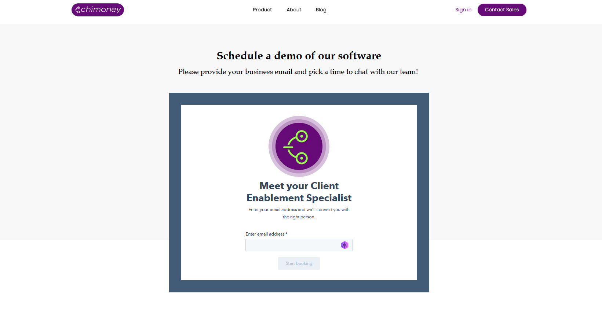

2. Pick an API plan to start with and pay the [subscription fee](https://www.chimoney.io/pricing) to get started.

# KNOWING THE API 
## (MODEL FIELD NAMES)
This section talks about the commonly used keywords across  the API.
<b>subAccounts</b>: A sub account can be created from the parent account, multiple subaccounts can be attached to a single parent account. To perform a transaction as a sub account, the ID of the subAccount should be passed into the API body as a json payload.


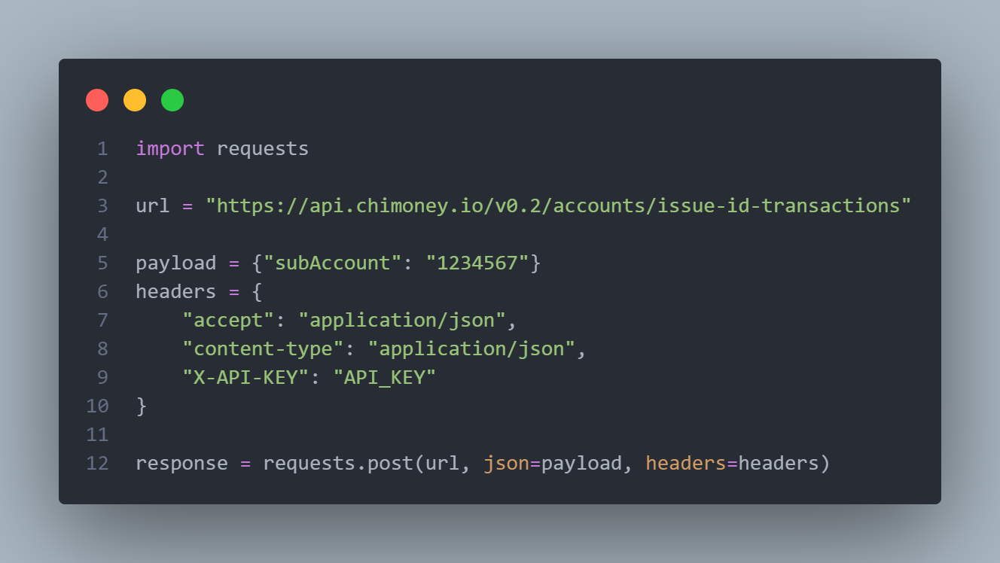

<b>issueID</b>: This is a reference Id to previously initiated chimoney transaction e.g "1233455667". It's value is a string

<b>chiREF</b>: Reference ID to another to previously initiated send chimoney transaction e.g "9ae0113-24345-4ie2625"

# Making API calls with Python
There are several endpoints for the CHICONNECT API, but they are categorized based on the functionality:

### Accounts
URL:  ```https://api.chimoney.io/v0.2/accounts/```
- To get transaction details by isuueID: URL/issue-id-transactions?issueID=9ae0100e

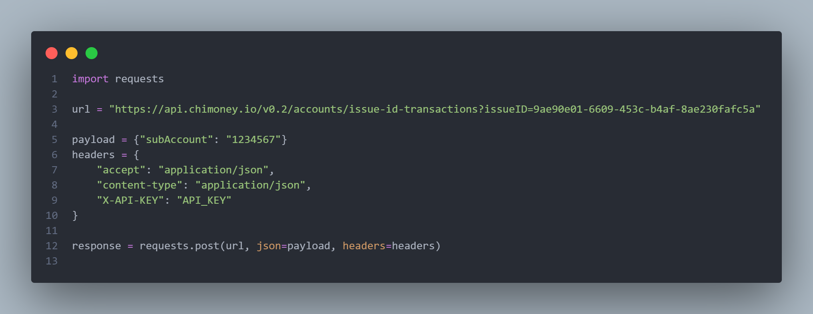

This API call will sends a POST request with query “issueID” as params in the URL. issueID is a string value.

- To get all transactions with account name: ```URL/transactions/```.
If a subAccount is available, requests send a POST request with subAccount id as A json Payload. subAccount is a string value.

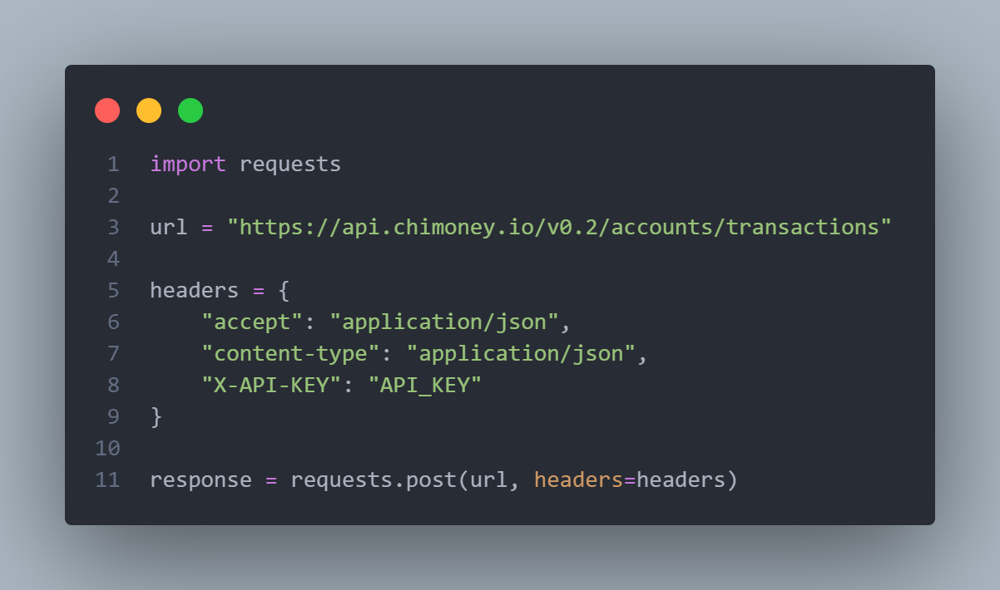

- To get a single transaction detail: ```URL/transactions?id=234``.
Sends a POST request with “id” as a query params in the url and “subAccount id” as a json Payload if available.

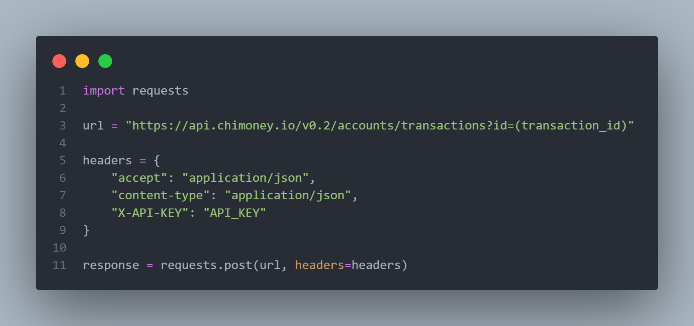


- To perform transfer between chimoney wallet: ```URL/transfer/```.

Sends a POST request with the fields “receiver”- the receiver id as a string, “amount”- the amount to transfer as an integer, “wallet”- the wallet type as a string and “subAccount id”- if available. The fields are included in the API body as a json payload.

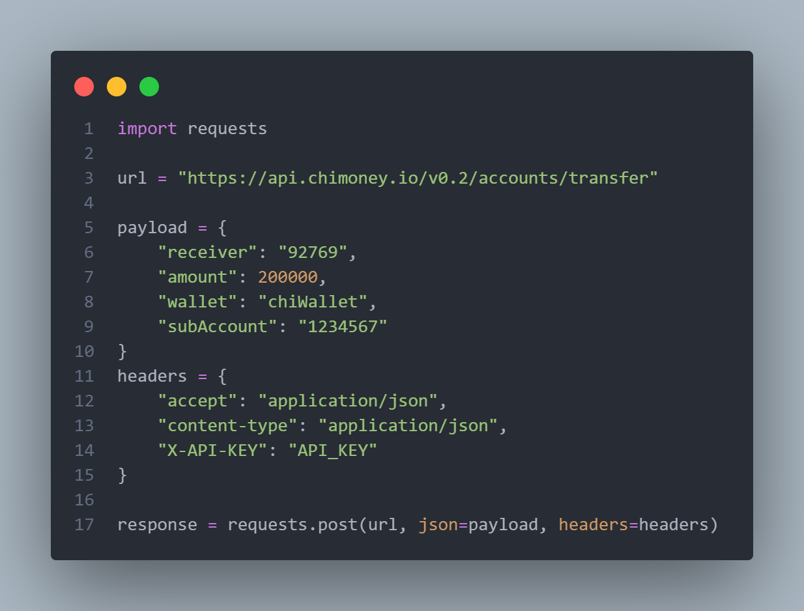

- Deleting unpaid transaction: ```URL/delete-unpaid-transaction```.

Sends a DELETE request with the query “chiREF”- reference ID to the transaction, as a params in the url.

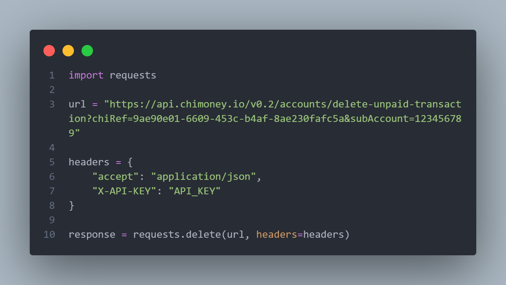

### Info
This endpoint shows the list of the various service offers: URL:```https://api.chimoney.io/v0.2/info/```.

- To get the list of all supported airtime Countries: ```URL/airtime-countries```.
 
 performs a get request to get the list of all available countries that the chiconnect covers and returns a json response.
 
 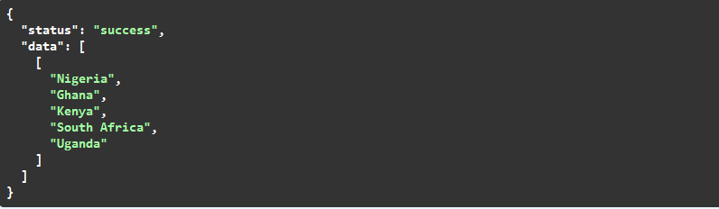
 
 - To get the list of all assets: ```URL/assets```
 
 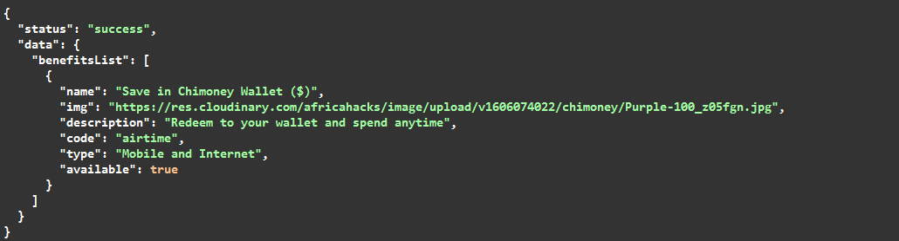
 
 - To get list of Supported banks and bank code: ```URL/country-banks?countryCode=NG```
 Sends a GET request with query “countryCode” as a param in the Url, response gets the list of supported banks and bank codes.
 
 
 
 - To convert your local currency amount to USD: ```URL/local-amount-in-usd?originCurrency=NGN&amountInOriginCurrency=50000```.
 Sends a GET request with the queries "amountInOriginCurrency" as an integer and "originCurrency" as a string in the URL, response converts amount of local currency to USD.
 
 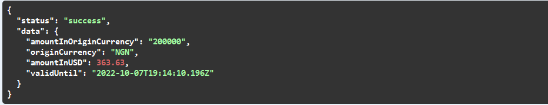
 
 - To get the list of all supported mobile money code: ```URL/mobile-money-codes```.
 Performs a GET request to get the list of supported mobile money(MOMO) codes.
 
 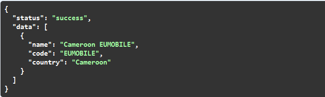
 
 - To convert usd amount to your Local Currency: ```URL/usd-amount-in-local?destinationCurrency=NGN&amountInUSD=3000```.
 Sends a GET request with the queries "destinationCurrency" as string & "amountInUSD" as Integer both as params in the URL, the response shows the conversion of currency from USD to to your local currency.
 
 
 
 
 ### Mobile Money(MOMO)
 The endpoints allows you perform momo transactions: URL:```https://api.chimoney.io/v0.2/collections/mobile-money/```.
 
 -To get the list of all mobile money transaction: ```URL/all```.
 This sends a POST request and returns the list of all mobile money(MOMO) transactions.
 
- To make payment through mobile money: ```URL/collect```.
Sends a POST request with the fields: subAccount(if available), "amount" as an integer, "phone number" as a string, "fullname" as a string, "country" as a string, "tx_ref(reference id)" as a string, all of the fields as a json payload.


- To verify each of your mobile money payment: ```URL/verify```.
 This sends a POST request with fields: subAccount(if available) and the ID-the transaction_id/payment_id as json payload.
 
 
 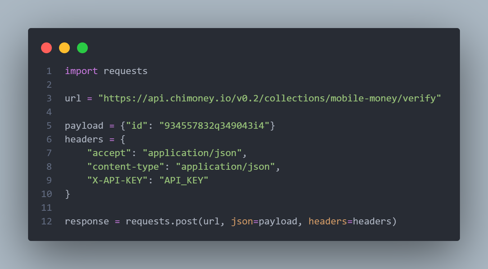
 
