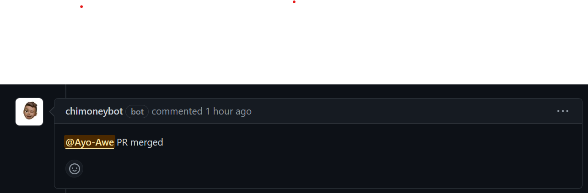
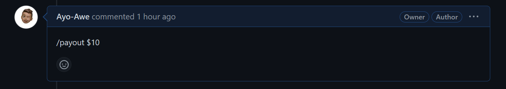
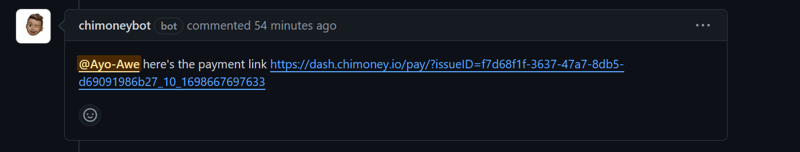

# chimoney-github-bot

> A GitHub App built with [Probot](https://github.com/probot/probot) that facilitates sponsoring GitHub contributors using the chimoney API

## Setup

- Head over to https://github.com/apps/chimoneybot
- Click the install button.
- Grant the bot access to any repository of your choice

## Usage

When a PR is merged, the repository maintainer will be notified as shown below.

To issue a payout, use the payout slash command as seen below

You'll be prompted to fulfill the transaction using the payment link provided

## Limitations

- For compliance purposes, the maximum payout for any given transaction is $10.
- The receipient's email address must be public

## Contributing

If you have suggestions for how chimoney-github-bot could be improved, or want to report a bug, open an issue! We'd love all and any contributions.

For more, check out the [Contributing Guide](CONTRIBUTING.md).

## License

[ISC](LICENSE) © 2023 Awe Ayomidipupo
