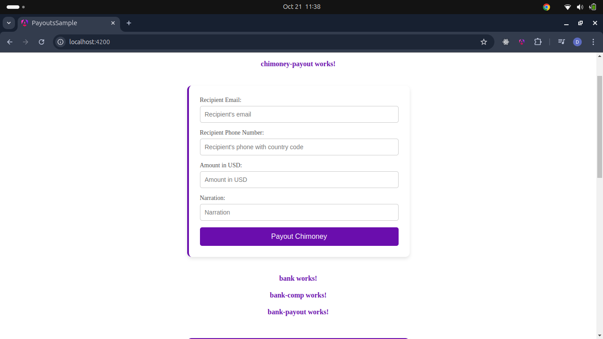
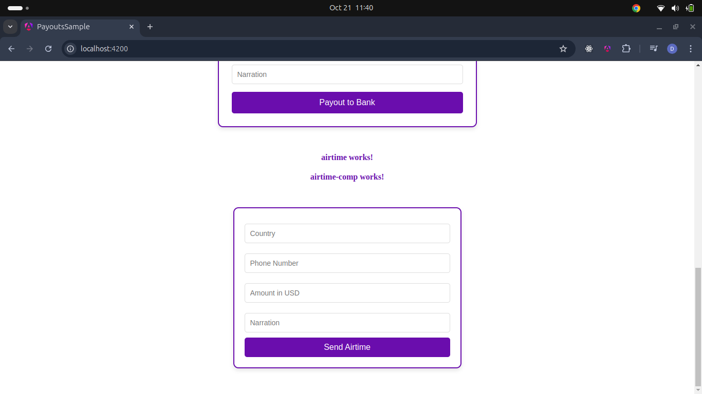

# ChimoneyLib

This project was generated with [Angular CLI](https://github.com/angular/angular-cli) version 18.2.3.

## Development server

Run `ng serve` for a dev server. Navigate to `http://localhost:4200/`. The application will automatically reload if you change any of the source files.

## Code scaffolding

Run `ng generate component component-name` to generate a new component. You can also use `ng generate directive|pipe|service|class|guard|interface|enum|module`.

## Build

Run `ng build` to build the project. The build artifacts will be stored in the `dist/` directory.

## Running unit tests

Run `ng test` to execute the unit tests via [Karma](https://karma-runner.github.io).

## Running end-to-end tests

Run `ng e2e` to execute the end-to-end tests via a platform of your choice. To use this command, you need to first add a package that implements end-to-end testing capabilities.

## Further help

To get more help on the Angular CLI use `ng help` or go check out the [Angular CLI Overview and Command Reference](https://angular.dev/tools/cli) page.


# ngx-chimoney-airtime-payouts

A library of reusable UI components for handling airtime and bank payouts in Angular applications, designed to enhance the user interface and streamline the development process.

## Installation

To install the library, follow these steps:

1. **Download the library package**:

   You can download the library package file, `ngx-chimoney-airtime-payouts-0.0.1.tgz`.

   ```bash
   npm install ./path/to/ngx-chimoney-airtime-payouts-0.0.1.tgz

   ```bash
   npm install @angular/forms

Usage
Step 1: Import the Library Module
In your main application module or any specific module where you want to use the components, import the required modules and components from the library.

typescript
Copy code
import { Component } from '@angular/core';
import { RouterOutlet } from '@angular/router';
import { FormsModule } from '@angular/forms';
import { PayoutsModule, PayoutsComponent, BankComponent, AirtimeComponent } from 'ngx-chimoney-airtime-payouts';

@Component({
  selector: 'app-root',
  standalone: true,
  imports: [
    RouterOutlet,
    PayoutsModule,
    PayoutsComponent,
    BankComponent,
    AirtimeComponent,
    FormsModule
  ],
  templateUrl: './app.component.html',
  styleUrls: ['./app.component.css']
})
export class AppComponent {
  title = 'payouts-sample';
}
Step 2: Using Components in Your Template
Once you have imported the components, you can use them in your HTML templates.

Example: Using PayoutsComponent
html
<payouts-component></payouts-component>

Example: Using BankComponent
html
<bank-component></bank-component>


Example: Using AirtimeComponent
html
<airtime-component></airtime-component>

Available Components

PayoutsComponent: A customizable component for handling various payout options.
BankComponent: A component designed for bank payouts, allowing users to input bank details.
AirtimeComponent: A component for processing airtime transactions.


## Payouts


## Bank payouts


## Airtime payouts


